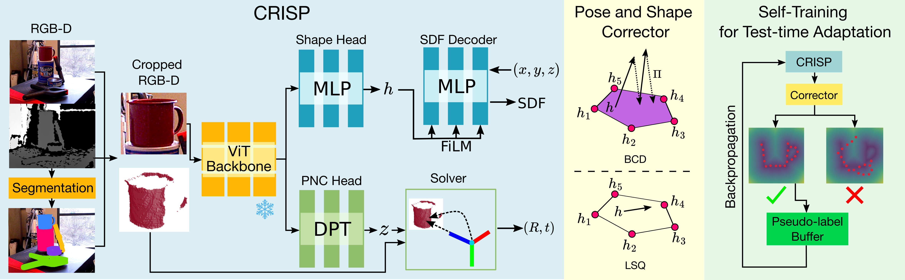
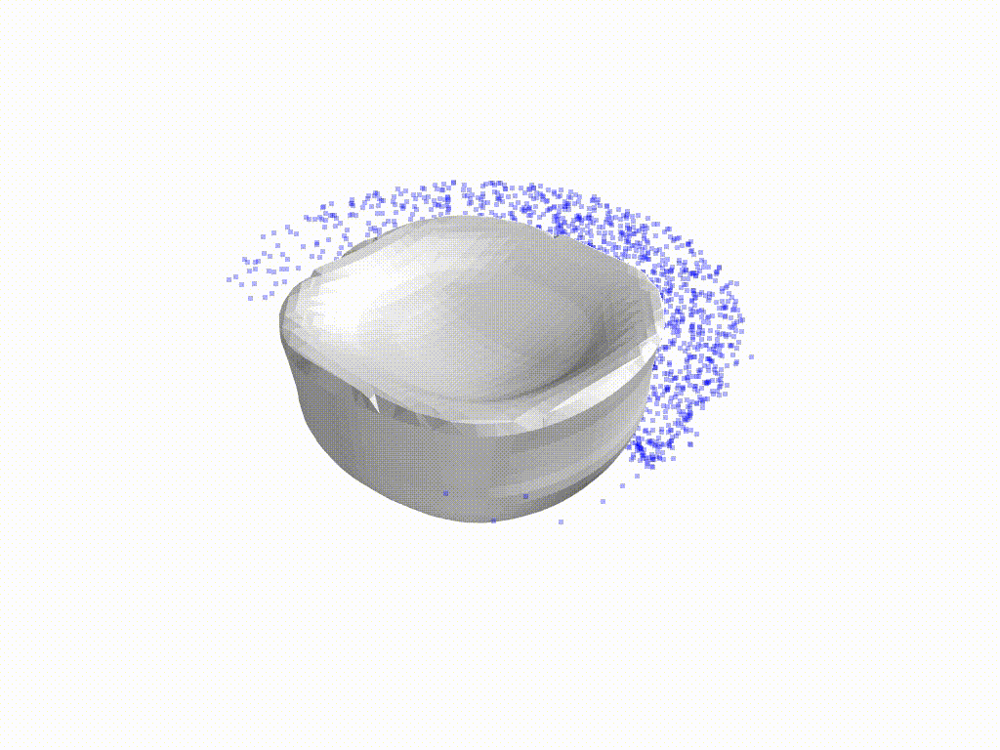
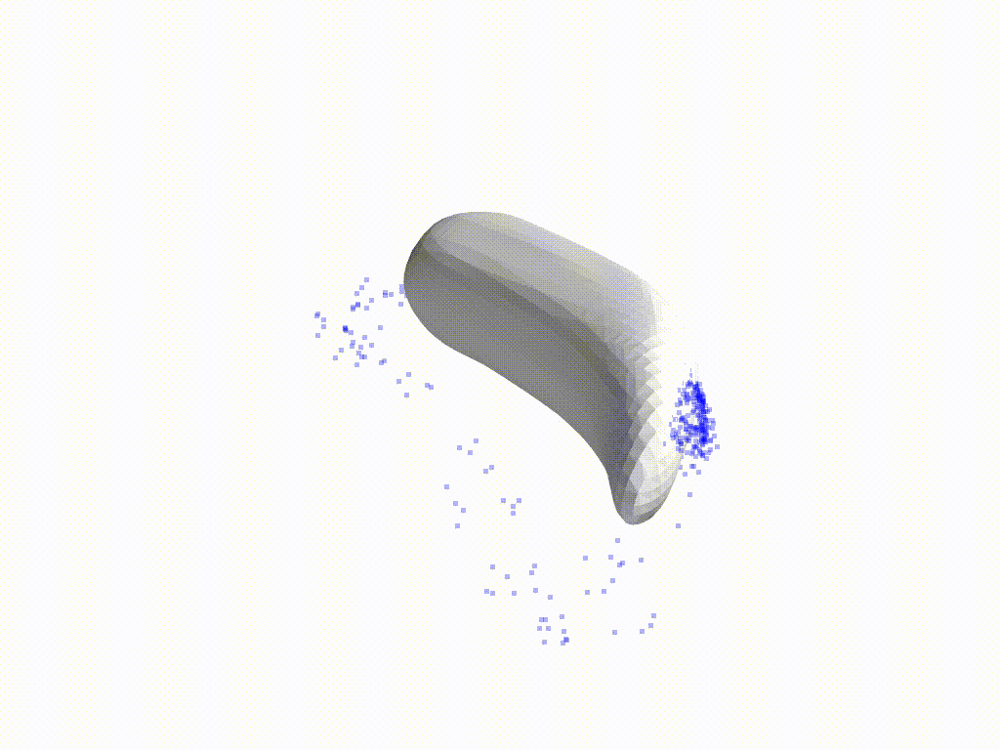
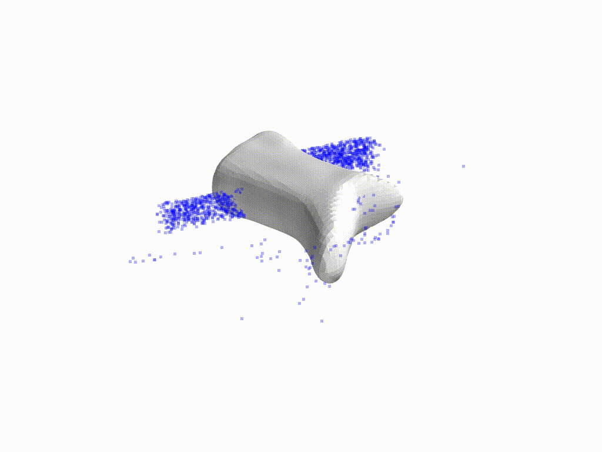
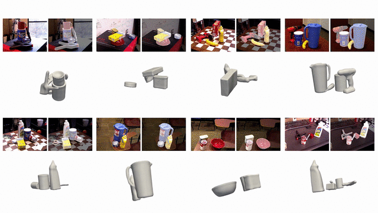
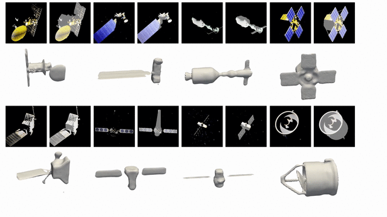
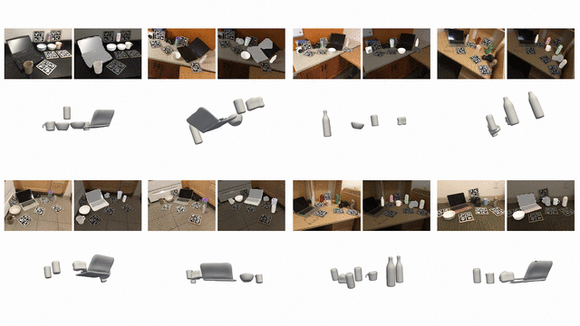
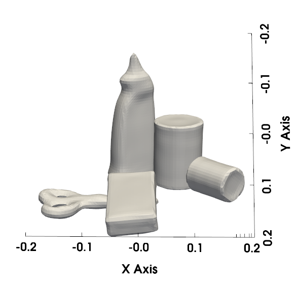

# CRISP: Object Pose and Shape Estimation with Test-Time Adaptation
**Accepted to :zap: CVPR 2025 :zap: .**

This is the project repo for the paper [CRISP: Object Pose and Shape Estimation with Test-Time Adaptation](https://arxiv.org/abs/2412.01052), which is accepted to CVPR 2025.
In this paper, we consider the problem of estimating object pose and shape from an RGB-D image. 

Our first contribution is to introduce CRISP, a category-agnostic object pose and shape estimation pipeline. The pipeline implements an encoder-decoder model for shape estimation. It uses FiLM-conditioning for implicit shape reconstruction and a DPT-based network for estimating pose-normalized points for pose estimation.



As a second contribution, we propose an optimization-based pose and shape corrector that can correct estimation errors caused by a domain gap. Observing that the shape decoder is well behaved in the convex hull of known shapes, we approximate the shape decoder with an active shape model, and show that this reduces the shape correction problem to a constrained linear least squares problem, which can be solved efficiently by an interior point algorithm.

|                  |                                            |                                            |                                            |
| ---              | ---                                        | ---                                        | ---                                        |
| Gradient Descent |  |  |  |
| Ours (BCD)       |     |     |     |

Third, we introduce a self-training pipeline to perform self-supervised domain adaptation of CRISP. The self-training is based on a correct-and-certify approach, which leverages the corrector to generate pseudo-labels at test time, and uses them to self-train CRISP. We demonstrate CRISP (and the self-training) on YCBV, SPE3R, and NOCS datasets. CRISP shows high performance on all the datasets. Moreover, our self-training is capable of bridging a large domain gap. Finally, CRISP also shows an ability to generalize to unseen objects.

Below are some qualitative results on YCBV, SPE3R and NOCS:
| Dataset | Qualitative Results |
|---------|-------------------|
| YCBV |  |
| SPE3R |  |
| NOCS |  |

If you use this project in your research, pleace cite:
```
@article{Shi24arxiv-crisp,
  title={CRISP: Object Pose and Shape Estimation with Test-Time Adaptation},
  author={Shi, Jingnan and Talak, Rajat and Zhang, Harry and Jin, David and Carlone, Luca},
  journal={arXiv preprint arXiv:2412.01052},
  year={2024}
}
```

## Installing Dependencies
We recommend using Mamba to manage your environment. Run the following command to create a new environment with the required dependencies:
```bash
mamba env create -f environment.yml
```

In addition, you need to compile and install PyTorch3D and xformers from source.
For PyTorch3D, build it from source:
```bash 
MAX_JOBS=N pip install -v "git+https://github.com/facebookresearch/pytorch3d.git@stable"
```
where you can set N to be the maximum number of workers used for ninja to compile files.

Make sure to have `CUDA_HOME` to the path of your CUDA installation.
In addition, you may need to set `FORCE_CUDA=1`. 

For xformers, clone it locally and compile:
```bash 
MAX_JOBS=N CUDA_HOME=/PATH_TO_CONDA_VIRTUAL_ENV python -m pip install -v git+https://github.com/facebookresearch/xformers.git@v0.0.23.post1#egg=xformers ```
where you can set N to be the maximum number of workers used for ninja to compile files.
Note that the compilation of xformers may take a long time.

## Running Experiments
Experimental code are kept in `experiments`.
Make sure to include `src` in your `PYTHONPATH` environmental variable to be able to import all the modules.
You can do something like this:
```bash
export PYTHONPATH="${PYTHONPATH}:${CRISP-Path}/src"
```
where `${CRISP-Path}` is the absolute path to this repo.

## Models
| Dataset   | Model Name         | Note                                                                  | URL                                                                                           |
| -------   | ----------         | ---                                                                   | ----                                                                                          |
| YCBV      | CRISP-Real         | Supervised on the real train set                                      | [Link](https://drive.google.com/file/d/1NV-kn4uzVVbgvoEitl8Y2VadgaUbQs6L/view?usp=drive_link) |
| YCBV Syn  | CRISP-Syn          | Supervised on our generated synthetic dataset                         | [Link](https://drive.google.com/file/d/1eYDLXI82me5aSd4QCKoaDfHkXZuLvLkK/view?usp=drive_link) |
| YCBV      | CRISP-Syn-ST (LSQ) | CRISP-Syn after test-time adaptation on the test set w/ LSQ corrector | [Link](https://drive.google.com/file/d/1htAxdRGU3NRezSwJXVspPnmDLp4IZV0S/view?usp=drive_link) |
| YCBV      | CRISP-Syn-ST (BCD) | CRISP-Syn after test-time adaptation on the test set w/ BCD corrector | [Link](https://drive.google.com/file/d/1JcnVaT5WmiTB4XE0sRylmqBWCKYrvMqT/view?usp=drive_link) |
| SPE3R     | CRISP              | Supervised on the train set                                           | [Link](https://drive.google.com/file/d/1nsaEMUejojXXX-l0PLipDoL8Xbw9cX4F/view?usp=drive_link) |
| SPE3R Syn | CRISP              | Supervised on our generated synthetic dataset                         | [Link](https://drive.google.com/file/d/1nsaEMUejojXXX-l0PLipDoL8Xbw9cX4F/view?usp=drive_link) |
| SPE3R     | CRISP-ST (BCD)     | Test-time adaptation on the test set                                  | [Link](https://drive.google.com/file/d/1_q1PdXI1EZEd7ojg6wQbty4gsY1Q6CuH/view?usp=drive_link) |
| NOCS      | CRISP              | Supervised on REAL and CAMERA                                         | [Link](https://drive.google.com/file/d/1GH4sJ5_1vNdbxi1V_n_Sm6593_MqRtZB/view?usp=drive_link) |

Hyperparameters used for each model are included in the zip files as `config.yaml`.

## Demo
A small demo with an image from YCBV is provided in the `experiments/demo` folder.
To run the demo, first modify the `ckpt_path` variable to point towards the checkpoint downloaded on your PC.
Then, run it with Python with the correct dependencies already installed:
```
python demo.py
```
You should see first an visualization of the meshes (in their canonical frames so they will overlap), 
then visualizations for the shape reconstructions transformed with the estimated transforms.
See the screenshot below:



## Datasets
We test on YCBV, SPE3R and NOCS datasets.

### YCBV
We follow the setup in the [BOP Challenge](https://bop.felk.cvut.cz/challenges/), which provides consistent formats and conventions across multiple object pose estimation datasets.
Download YCBV from [this page](https://bop.felk.cvut.cz/datasets/#YCB-V), and follow their instruction to unzip everything.
The final folder structure should look something like this:
```
bop_datasets
└── ycbv
    ├── camera_cmu.json
    ├── camera_uw.json
    ├── dataset_info.md
    ├── models
    ├── models_bop-compat
    ├── models_bop-compat_eval
    ├── models_eval
    ├── models_fine
    ├── object_images
    ├── test
    ├── test_targets_bop19.json
    ├── train_pbr
    ├── train_real
```

### SPE3R
The SPE3R dataset is a satellite pose estimation dataset based on photorealistic renders of real-world satellites. 
Download the dataset from [this page](https://purl.stanford.edu/pk719hm4806).
Note that v1 of the dataset has some bugs in the annotations --- please use v1.1 (see [here](https://github.com/tpark94/sat-sq-recon)).
You will then need to follow the steps detailed in the [README](https://github.com/tpark94/sat-sq-recon) to prepare the dataset.
The structure should look like this:
```
spe3r
├── camera.json
├── splits.csv
├── LICENSE.md
├── README.md
├── UPDATES.md
├── acrimsat_final
├── apollo_soyuz_carbajal
├── aqua
├── aquarius_dep
├── aquarius_ud
├── ... and more satellite folders
```

In addition, you need to run some preprocessing steps to generate the depth and NOCS data for training our models. 
The scripts are available in our forked repo: [sat-sq-recon](https://github.com/jingnanshi/sat-sq-recon/tree/main).
In particular, you will need to run the [preprocess_depth.py](https://github.com/jingnanshi/sat-sq-recon/blob/main/tools/preprocess_depth.py) script to generate the depth and NOCS data.
We also provide a [helper script](https://github.com/jingnanshi/sat-sq-recon/blob/main/tools/gen_preprocess_depth_script.py) to generate commands for running the script with GNU parallel to speed up the generation process.

### NOCS
To set up the NOCS dataset, download zip files from [this page](https://github.com/hughw19/NOCS_CVPR2019) and follow their instructions.
In addition, download the segmentation results from [this link](https://drive.google.com/file/d/1RwAbFWw2ITX9mXzLUEBjPy_g-MNdyHET/view?usp=sharing) (the same result used in [DualPoseNet](https://github.com/Gorilla-Lab-SCUT/DualPoseNet)) and unzip into the same folder.
The final folder structure should look like this:
```
NOCS
├── camera
├── camera_full_depths
├── gt_results
├── obj_models
├── real
└── segmentation_results
```

### Rendered Images
For the YCBV experiments, we also generate our own rendered images forming a simulated train set to test our ability to bridge the sim-to-real gap.
You can download it [here](https://drive.google.com/file/d/11tsTWR3eqf7WSMN3oyfeBX7WGV8UWSXl/view?usp=sharing).

## Training
Here are the details for training our models on YCBV, SPE3R and NOCS dataset.
Hyperparameters used for each dataset's models are included in the zip files of the checkpoints as `config.yaml` (see table above).

### YCBV
To train models on the YCBV dataset, note that we have two subfolders in the `experiments` folder that are relevant.
For supervised training, `experiments/ycbv_supervised` contains the necessary scripts.
A typical training command should look something like this:
```
python train.py --dataset_dir=/home/"$(whoami)"/datasets/unified_renders/ycbv_0830_v2 \
  --bop_data_dir=/home/"$(whoami)"/datasets/bop/bop_datasets \
  --preload_to_mem=False \
  --nocs_network_type=dpt_gnfusion_gnnocs \
  --nocs_lateral_layers_type=spaced \
  --normalized_recons=False \
  --nocs_loss_weight=5e3 \
  --recons_loss_weight=0.1 \
  --batch_size=10 \
  --dataloader_workers=5 \
  --num_epochs=50 
```
where `dataset_dir` is the path to our generated synthetic data and `bop_data_dir` is the path to the folder containing the YCBV dataset.
We assume it is in the `ycbv` folder and follows BOP convention.

For test-time adaptation (self-supervised), take a look at `experiments/ycbv_ssl`.
Run the following command (modify the relevant parameters to fit your own setup):
```
python train.py --checkpoint_path=$CKPT_FOLDER/checkpoint.pth \
  --bop_ds_dir=$DATASET_PATH/bop_datasets \
  --scenes_mode="mixed" \
  --num_epochs=100 \
  --pose_noise_scale=0 \
  --dataloader_batch_size=3 \
  --ssl_batch_size=3 \
  --gen_mesh_for_test=False \
  --visualize_rgb=False \
  --pipeline_no_grad_model_forward=True \
  --use_corrector=True \
  --use_mf_shape_code_corrector=False \
  --use_mf_geometric_shape_corrector=True \
  --mf_geometric_corrector_type="PROJ_GD" \
  --mf_geometric_corrector_lr=5e-4 \
  --shape_code_library_path=$DATASET_PATH/shape_code_lib.pkl \
  --mf_corrector_min_buffer_size=25 \
  --mf_geometric_corrector_nocs_sample_size=1000 \
  --mf_geometric_corrector_mnfld_weight=3e3 \
  --mf_geometric_corrector_inter_weight=1e2 \
  --mf_corrector_rolling_window_size=50 \
  --frame_corrector_mode="nocs-only-inv-depths-sdf-input-nocs-scale-free" \
  --ssl_recons_lr=3e-4 \
  --use_torch_compile=False \
  --corrector_algo="torch-adam" \
  --corrector_sdf_input_loss_weight=10 \
  --corrector_sdf_nocs_loss_weight=1 \
  --corrector_nocs_correction_lr=1e-3 \
  --corrector_shape_correction_lr=5e-5 \
  --corrector_max_iters=50 \
  --use_torch_compile=False \
  --normalized_recons=False \
  --cert_depths_quantile=0.98 \
  --cert_depths_eps=0.01 \
  --objects_info_path=$DATASET_PATH/unified_renders/ycbv_0830_v2/objects_info.yaml \
  --unified_ds_dir=$DATASET_PATH/unified_renders/ycbv_0830_v2 \
  --fixed_random_seed=False
```
The important parameters are:
- `checkpoint_path`: Path to the checkpoint file to start test-time adaptation on (usually a model trained on synthetic data).
- `unified_ds_dir`: Path to our generated synthetic dataset with ground truth meshes and SDFs (only used for visualization). 
- `bop_ds_dir`: Path to the folder containing YCBV dataset (in a folder named `ycbv` following the BOP conventions).
- `objects_info_path`: Path to a YAML file containing GT objects info (for error metrics only).
- `shape_code_library_path`: Path to the PKL file containing latent shape codes for our correctors (see below on how to generate these codes).

### SPE3R
The scripts relevant for the SPE3R experiment can be found in `experiments/satellite`.
To run supervised training, run the following command (after modifying the arguments):
```
python train.py \
  --dataset_dir=/home/"$(whoami)"/datasets/spe3r \
  --spe3r_unified_objects_dataset_dir=/home/"$(whoami)"/datasets/unified_renders/spe3r_train_objs_0709 \
  --preload_to_mem=False \
  --nocs_network_type=dpt_gnfusion_gnnocs \
  --nocs_lateral_layers_type=spaced \
  --normalized_recons=False \
  --lr=1e-4 \
  --nocs_lr=1e-4 \
  --recons_lr=1e-4 \
  --weight_decay=1e-6 \
  --cosine_anneal_T_mult=1 \
  --checkpoint_path=/home/"$(whoami)"/code/CRISP/experiments/unified_model/model_ckpts/202407091738_OREEM/checkpoint.pth \
  --resume_from_ckpt=True \
  --batch_size=16 \
  --validate_per_n_epochs=20 \
  --num_epochs=100 \
  --dataloader_workers=5
```
The important arguments are:
- `dataset_dir`: Directory of the SPE3R dataset.
- `spe3r_unified_objects_dataset_dir`: Directory of our generated synthetic dataset (for object SDFs)

To run test-time adaptation, run the following command:
```
python train.py \
  --dataset_dir=/home/"$(whoami)"/datasets/spe3r \
  --spe3r_unified_objects_dataset_dir=/home/"$(whoami)"/datasets/unified_renders/spe3r_0228 \
  --preload_to_mem=False \
  --nocs_network_type=dpt_gnfusion_gnnocs \
  --nocs_lateral_layers_type=spaced \
  --normalized_recons=False \
  --checkpoint_path=/home/"$(whoami)"/code/CRISP/experiments/satellite/model_ckpts/202407150923_6OOGB/checkpoint.pth \
  --resume_from_ckpt=True \
  --optimizer=sgd \
  --batch_size=16 \
  --num_epochs=20 \
  --dataloader_workers=5 \
  --num_devices=1 \
  --num_nodes=1 \
  --train_mode=ssl \
  --test_split=test \
  --train_split=test \
  --model_type=pipeline \
  --cert_depths_quantile=0.97 \
  --cert_depths_eps=0.02 \
  --pipeline_nr_downsample_before_corrector=2000 \
  --use_corrector=True \
  --frame_corrector_mode="nocs-only-inv-depths-sdf-input-nocs-scale-free" \
  --corrector_algo="torch-adam" \
  --corrector_sdf_input_loss_weight=1 \
  --corrector_sdf_nocs_loss_weight=1 \
  --corrector_nocs_correction_lr=5e-4 \
  --corrector_shape_correction_lr=5e-5 \
  --corrector_max_iters=50 \
  --use_mf_shape_code_corrector=False \
  --use_mf_geometric_shape_corrector=True \
  --mf_geometric_corrector_type="PROJ_GD" \
  --mf_geometric_corrector_lr=5e-3 \
  --shape_code_library_path=/home/gridsan/"$(whoami)"/datasets/shape_code_libraries/spe3r/202407150923_6OOGB/shape_code_lib.pkl \
  --mf_corrector_min_buffer_size=25 \
  --mf_corrector_rolling_window_size=50 \
  --mf_geometric_corrector_nocs_sample_size=2000 \
  --mf_geometric_corrector_mnfld_weight=3e3 \
  --mf_geometric_corrector_inter_weight=1e2 \
  --mf_geometric_corrector_nonmnfld_points_voxel_res=32
```
The important parameters are:
- `dataset_dir`: Directory of the SPE3R dataset.
- `spe3r_unified_objects_dataset_dir`: Directory of our generated synthetic dataset (for object SDFs)
- `checkpoint_path`: Path to the checkpoint file to start test-time adaptation on (usually a model trained on synthetic or rendered data).
- `shape_code_library_path`: Path to the PKL file containing latent shape codes for our correctors (see below on how to generate these codes).

### NOCS
To train a supervised model on NOCS, take a look at the `experiments/nocs` folder.
The training command should be similar to the one below:
```
python train.py \
  --dataset_dir=/home/gridsan/"$(whoami)"/datasets/NOCS \
  --nocs_unified_objects_dir=/home/gridsan/"$(whoami)"/datasets/unified_renders/nocs_camera_real_train \
  --subsets=[camera,real] \
  --split=train \
  --preload_to_mem=False \
  --nocs_network_type=dpt_gnfusion_gnnocs \
  --nocs_lateral_layers_type=spaced \
  --normalized_recons=False \
  --lr=1e-4 \
  --nocs_lr=1e-4 \
  --recons_lr=1e-4 \
  --weight_decay=1e-6 \
  --cosine_anneal_T_mult=1 \
  --batch_size=16 \
  --num_epochs=50 \
  --dataloader_workers=10 \
```
The key arguments are:
- `dataset_dir`: Path to the folder containing all NOCS data.
- `nocs_unified_objects_dir`: Path to the folder containing objects' infos for NOCS.

### Generating Shape Code Libraries
To generate the shape code libraries used for test-time adaptation, take a look at `experiments/latent_code` folder.
Basically, you need to run `X_object_codes_interpolate.py` to collect latent codes for dataset `X`,
then you need to run `make_shape_code_library.py` to essentially take the average of the latent codes for each learned shape and generate a .pkl file. 
You can find the pregenerated shape code libraries [here](https://drive.google.com/drive/folders/1YVn4G8Ys2xjbfQBnsJmy7IHlPdBK3oFB?usp=sharing).

### Using SLURM
Our training scripts supports SLURM through PyTorch Lightning.
For example, for training supervised models on YCBV, a typical training script should look something like this:
```
#!/bin/bash
#SBATCH --job-name ycbv_real_train
#SBATCH -N 2
#SBATCH --ntasks-per-node=2
#SBATCH --gres=gpu:volta:2
#SBATCH --cpus-per-task=20
#SBATCH --distribution=nopack

source /etc/profile
# Load your dependencies/modules ...

export OMP_NUM_THREADS=20
srun python train.py --dataset_dir=/home/"$(whoami)"/datasets/unified_renders/ycbv_0830_v2 \
  --bop_data_dir=/home/"$(whoami)"/datasets/bop/bop_datasets \
  --preload_to_mem=False \
  --nocs_network_type=dpt_gnfusion_gnnocs \
  --nocs_lateral_layers_type=spaced \
  --normalized_recons=False \
  --nocs_loss_weight=5e3 \
  --recons_loss_weight=0.1 \
  --batch_size=10 \
  --dataloader_workers=5 \
  --num_epochs=50 \
  --num_devices=2 \
  --num_nodes=2
```
